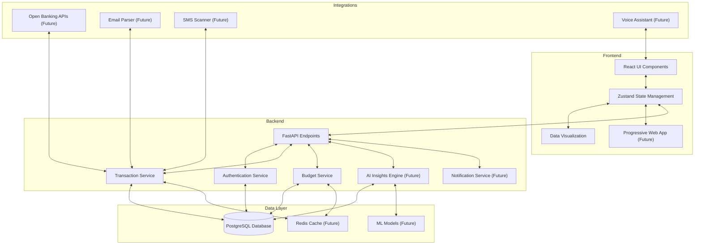
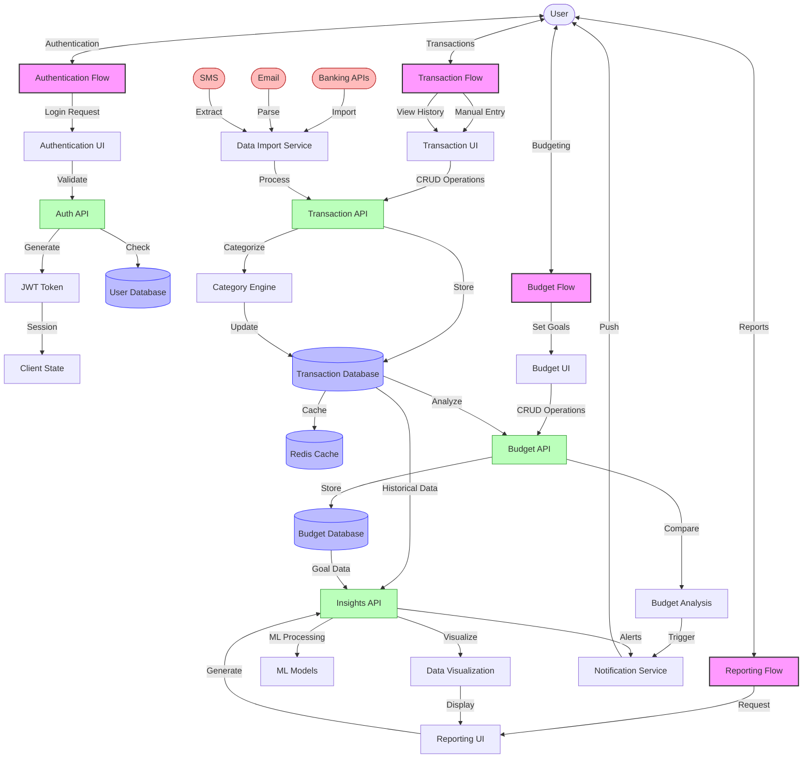

# Finance Tracker Application

A comprehensive personal finance tracker with React.js frontend and FastAPI backend.

## Features

- **User Authentication**: Secure signup and login
- **Dashboard**: Financial summary with income, expenses, and budget overview
- **Transactions**: Add, view, update, and delete financial transactions
- **Analytics**: Visualize spending patterns and financial trends
- **Modern UI**: Clean, responsive interface with Tailwind CSS

## Tech Stack

### Frontend
- React.js with Vite
- React Router for navigation
- Zustand for state management
- Tailwind CSS for styling
- Recharts for data visualization
- Axios for API requests

### Backend
- FastAPI for API endpoints
- JWT for authentication
- SQLAlchemy ORM
- PostgreSQL database
- Pydantic for data validation

## Getting Started

### Prerequisites
- Docker and Docker Compose (recommended for easy setup)
- Node.js (v16+) and npm
- Python 3.11+
- PostgreSQL

### Setup with Docker (Recommended)

1. Clone the repository:
   ```
   git clone <repository-url>
   cd finance-tracker
   ```

2. Start the application with Docker Compose:
   ```
   docker-compose up -d
   ```

3. Access the application:
   - Frontend: http://localhost:5173
   - Backend API: http://localhost:8000
   - API Docs: http://localhost:8000/api/docs

### Manual Setup

#### Backend

1. Navigate to the backend directory:
   ```
   cd backend
   ```

2. Create a virtual environment:
   ```
   python -m venv venv
   source venv/bin/activate  # On Windows: venv\Scripts\activate
   ```

3. Install dependencies:
   ```
   pip install -r requirements.txt
   ```

4. Run the application:
   ```
   uvicorn app.main:app --reload
   ```

#### Frontend

1. Navigate to the frontend directory:
   ```
   cd frontend
   ```

2. Install dependencies:
   ```
   npm install
   ```

3. Start the development server:
   ```
   npm run dev
   ```

## Application Structure

### Frontend Structure
```
frontend/
├── src/
│   ├── components/         # Reusable components
│   │   ├── Auth/           # Authentication components
│   │   ├── Dashboard/      # Dashboard components
│   │   ├── Navigation/     # Navigation components
│   │   ├── Transactions/   # Transaction components
│   │   └── Analytics/      # Analytics components
│   ├── pages/              # App pages
│   ├── store/              # Zustand store
│   ├── utils/              # Utility functions
│   ├── App.jsx             # Main app component
│   └── main.jsx            # Entry point
└── ...
```

### Backend Structure
```
backend/
├── app/
│   ├── models/             # Database models
│   ├── routes/             # API routes
│   ├── schemas/            # Pydantic schemas
│   ├── core/               # Core functionality
│   └── main.py             # FastAPI app entry point
└── ...
```

## API Endpoints

### Authentication
- `POST /api/auth/signup` - Create a new user
- `POST /api/auth/login` - Login and get token
- `GET /api/auth/me` - Get current user info

### Transactions
- `GET /api/transactions` - Get all transactions
- `POST /api/transactions` - Create a new transaction
- `GET /api/transactions/{id}` - Get a specific transaction
- `PUT /api/transactions/{id}` - Update a transaction
- `DELETE /api/transactions/{id}` - Delete a transaction
- `GET /api/transactions/summary` - Get transaction summary

### Analytics
- `GET /api/analytics` - Get financial analytics data

## Architecture Diagram




## Data Flow Diagram



## Future Enhancements

- Budget planning and tracking
- Financial goals setting
- Recurring transactions
- Export data to CSV/PDF
- Mobile app version
- Dark/light theme toggle

## Contributing

1. Fork the repository
2. Create your feature branch (`git checkout -b feature/amazing-feature`)
3. Commit your changes (`git commit -m 'Add some amazing feature'`)
4. Push to the branch (`git push origin feature/amazing-feature`)
5. Open a Pull Request

## License

This project is licensed under the MIT License - see the LICENSE file for details.
